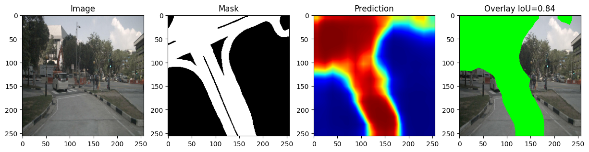

# 🚗 Drivable Space Segmentation

## 📌 Overview
This project focuses on detecting drivable road regions using deep learning techniques. It helps autonomous vehicles understand where they can safely drive.

---

## 🧠 Model
- DeepLabV3 with MobileNet backbone
- Binary segmentation (Road vs Non-road)

---

## 📊 Performance
- IoU: ~0.70 – 0.80
- FPS: ~120 (fast inference)

---

## 📁 Dataset
- nuScenes v1.0-mini
- 200 images → 110 valid samples after cleaning

---

## ⚙️ Features
- Data preprocessing & filtering
- Dice + BCE combined loss
- Real-time inference
- Overlay visualization

---

## 📷 Sample Output

---

## 🚀 How to Run
1. Open notebook in Google Colab
2. Mount Google Drive
3. Run all cells

---

## 👨‍💻 Team
Neuro Drive
